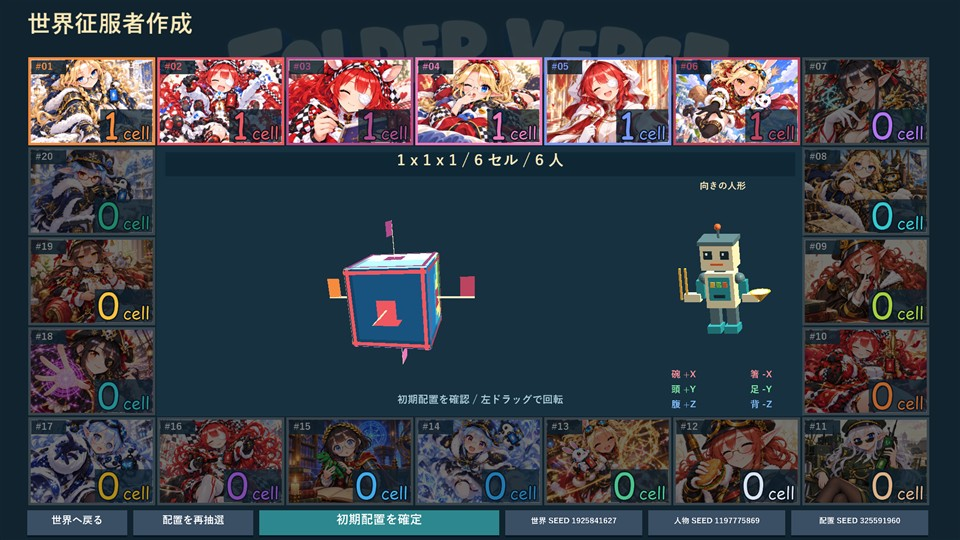

# フォルダーバース

フォルダーバース（Folder Verse；畳域）は、ニコニコ動画などの生配信で、配信者も視聴者も楽しめる、20分ほどで遊び終わるゲームを目指しています。  
女の子の征服者を選び、兵隊ロボットを製造・輸送して、立体世界の領地を広げるストラテジーゲームです。  
たとえば、ロボットと一緒に隣の都市へ進軍し、自動戦闘を観戦して、勝った相手を手下にできます。

開発中の画面です。（2026年10月10日時点の試作版）

動作環境：Windows 11 想定。

## ユーザー_すぐ遊びたい人

現在は開発版です。ダウンロードして遊べる配布版はまだありません。

- [配布状況と起動方法](docs/user/README.md)
- [操作ガイド](docs/user/操作ガイド.md)

## リサーチャー_しっかり理解したい人

- [ゲームの仕組み](docs/ref/ゲームの仕組み.md)：ロボット・戦闘・人物抽選・地図と節点。
- [仕様の読み方](docs/ref/README.md)：実装中のルールと世界観の原本。

## デベロッパー_開発に興味がある人

- [開発を始める](docs/dev/README.md)：Visual Studioでの起動、検証、画像管理。
- [実装と検証の記録](docs/dev/実装と検証.md)：IMEの調査、グラフィックと画像加工。
- [実装計画](docs/dev/plan/)・[開発日誌](docs/dev/log/2026/10.md)
- [続きはここから](docs/続きはここから.md)：作業を再開する人向け。

## 一般_このプロジェクトに興味はないが関心はある人

- [プロジェクトについて](docs/pub/README.md)：制作の目的、現在の開発・配布状況。

[ドキュメント全体の案内](docs/README.md)
